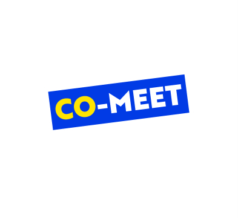

# 로컬 가이드 매칭 및 여행 트랜드 제공(Co-meet)

국민대학교 소프트웨어학부 캡스톤 프로젝트 14조

## 1. 프로젝트 소개

본 프로젝트는 외국인에게 새로운 한국의 관광문화 플랫폼을 제공함에 의의를 둔다.
외국인이 한국 관광을 오기 위해 정보 검색을 하고자 한다면 언어의 장벽이 있어 몇 없는 자국민 블로거의 후기나 여행사의 도움을 받을 수 밖에 없다. 그렇기에 외국 관광객들은 한국 현지인들과 정보의 질과 양 면에서 극명한 차이를 보인다. 재미있고 실속 있는, 현재 유행하는 관광 정보들은 현지인 사이에서만 유통되어 생기는 정보의 비대칭을 완화하고자 한다.
총 두 가지의 해결방안을 제시하고자 한다.
한국의 SNS 상에 퍼져 있는 여행 정보 빅데이터를 얻어와 특정 기준을 잡고 정보를 분석, 현재 한국의 트랜드를 볼 수 있는 키워드를 여행자에게 제공한다. 지역의 맛집, 놀거리 등 현재 가장 인기있는 키워드를 시각적으로 제공하여 본인에게 맞는 관광 테마, 카테고리를 지정할 수 있다.
키워드 정보만으로는 정보 불균형을 완화시킬 수 없다. 커밋은 여행객에게 현지 로컬을 매칭, 그들만의 투어를 새로 만들 수 있도록 도움을 준다. 간단한 인증 단계를 거친 로컬들은 자신만의 테마, 여행 팁을 가지고 있으며 외국어 능력(레벨 부여)을 보유해야만 한다. 여행객들은 로컬을 선택, SNS 채팅 대화를 통해 여행을 계획하는 동시에 글로벌 친구를 만들 수 있다.


## 2. 소개 영상

[](https://www.youtube.com/watch?v=HoR4ngWcaEA "comeet")
커밋사이트 http://comeet-test-1.s3-website.ap-northeast-2.amazonaws.com

## 3. 팀 소개

### -지도교수 김인규 교수님

### -이정준


```markdown
* e-mail : ejuju1997@naver.com
* role : 팀장, 웹 페이지 디자인 및 html, css, javascript를 이용한 Front-end,Back-end 개발
```
### -양동혁


```markdown
* e-mail : vibgyor96@icloud.com
* role : 팀원, AWS를 이용한 웹 환경 구축과 데이터베이스 설계, 작성, 관리
```

### -조성주


```markdown
* e-mail : tjdwn2032@naver.com
* role : 팀원, 웹 페이지 디자인 및 html, css, javascript를 이용한 Front-end,Back-end 개발
```


### -최필준


```markdown
* e-mail : abzi110@kookmin.ac.kr
* role : 팀원, AWS를 이용한 웹 환경 구축과 웹 크롤링 시스템 구축
```

## 4. Abstract

The project is meaningful in providing foreigners with a new Korean tourism and cultural platform. If a foreigner wants to search information to come to Korea for a tour, there is a barrier to language, which is why he or she has to get help from a few local bloggers or travel agencies. That's why foreign tourists show significant differences in the quality and quantity of information with Korean locals. We want to mitigate the asymmetry of information caused by the circulation of current tourist information among local people. We would like to present two solutions in total.
First, it gets Bigdata on travel information spread on social networking sites in Korea, sets certain criteria and analyzes information, and provides travelers with keywords to see current trends in Korea. Visitors can visually provide the most popular keywords, such as local restaurants and entertainment, to designate tourism themes and categories that suit them.
Second, Co-meet helps travelers match locals and create new tours of their own. Local people who have undergone a simple certification phase have their own themes, travel tips, and must have foreign language skills. Travelers can make global friends while planning trips via e-mail after choosing local.
